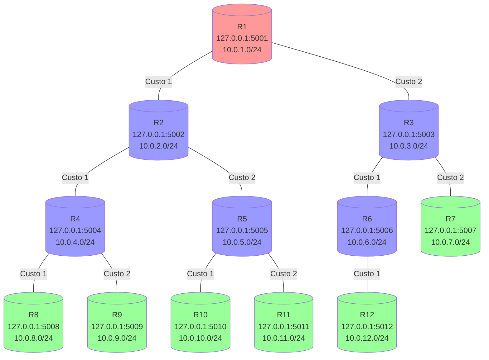

# Arquitetura da Rede - Grupo 7 (Topologia Tree)



## Descrição da Topologia

Esta é uma topologia de **árvore** com 12 roteadores organizados em 4 níveis:

### Nível 1 (Raiz)
- **R1**: roteador raiz da árvore

### Nível 2 (Primeiro nível de filhos)
- **R2**: filho de R1 (custo 1)
- **R3**: filho de R1 (custo 2)

### Nível 3 (Segundo nível de filhos)
- **R4**: filho de R2 (custo 1)
- **R5**: filho de R2 (custo 2)
- **R6**: filho de R3 (custo 1)
- **R7**: filho de R3 (custo 2)

### Nível 4 (Terceiro nível de filhos - Folhas)
- **R8**: filho de R4 (custo 1)
- **R9**: filho de R4 (custo 2)
- **R10**: filho de R5 (custo 1)
- **R11**: filho de R5 (custo 2)
- **R12**: filho de R6 (custo 1)

## Características da Topologia

1. **Estrutura Hierárquica**: cada roteador tem no máximo um pai.
2. **Custos**: links com custos 1 e 2 para testar convergência.
3. **Sumarização**: toda estrutura para demonstrar.
4. **Convergência**: rápida, esperada em poucos ciclos.

## Comandos para Executar

Para testar esta topologia, execute os seguintes comandos em terminais separados:

```bash
# Terminal 1 - R1 (Raiz)
python roteador.py -p 5000 -f grupo7/R1.csv --network 10.0.1.0/24

# Terminal 2 - R2
python roteador.py -p 5000 -f grupo7/R2.csv --network 10.0.2.0/24

# Terminal 3 - R3
python roteador.py -p 5000 -f grupo7/R3.csv --network 10.0.3.0/24

# Terminal 4 - R4
python roteador.py -p 5000 -f grupo7/R4.csv --network 10.0.4.0/24

# Terminal 5 - R5
python roteador.py -p 5000 -f grupo7/R5.csv --network 10.0.5.0/24

# Terminal 6 - R6
python roteador.py -p 5000 -f grupo7/R6.csv --network 10.0.6.0/24

# Terminal 7 - R7
python roteador.py -p 5000 -f grupo7/R7.csv --network 10.0.7.0/24

# Terminal 8 - R8
python roteador.py -p 5000 -f grupo7/R8.csv --network 10.0.8.0/24

# Terminal 9 - R9
python roteador.py -p 5000 -f grupo7/R9.csv --network 10.0.9.0/24

# Terminal 10 - R10
python roteador.py -p 5000 -f grupo7/R10.csv --network 10.0.10.0/24

# Terminal 11 - R11
python roteador.py -p 5000 -f grupo7/R11.csv --network 10.0.11.0/24

# Terminal 12 - R12
python roteador.py -p 5000 -f grupo7/R12.csv --network 10.0.12.0/24
```
